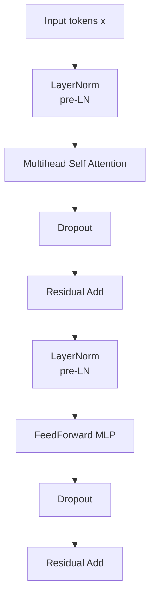
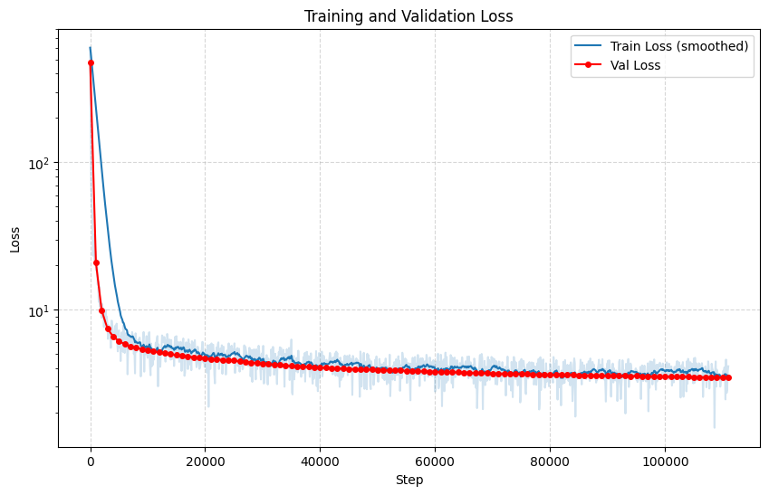

## GPT-A-Minimal-Interpretable-Implementation
A ground-up PyTorch implementation focusing on attention mechanics, masking, and normalization design choices.
[](https://huggingface.co/spaces/ianhaimo/GPT-A-Minimal-Interpretable-Implementation)

## Project Motivation
Most Transformer tutorials rely heavily on high-level PyTorch modules, which obscures critical design details such as attention masking, normalization placement, and tensor reshaping across heads.
This project aims to rebuild a minimal Transformer from scratch to deeply understand its internal mechanics and trade-offs, while keeping the implementation readable and debuggable.

## Architecture Overview


## Key Implementations & Trade-offs
### 3.1 Manual Attention Masking
Instead of relying on PyTorch’s built-in causal attention, I explicitly construct attention masks and apply -inf before softmax.
### 3.2 Custom LayerNorm vs nn.LayerNorm
I implemented a custom LayerNorm to verify normalization behavior, then replaced it with nn.LayerNorm for efficiency. Both implementations were kept to compare correctness and performance.
### 3.3 Multi-Head Attention Reshaping
The model explicitly reshapes the embedding dimension d_model into (num_heads, head_dim) to ensure independent attention subspaces. This helped clarify why individual heads have reduced representational capacity but gain diversity through parallel attention.
### 3.4 Rotary Positional Embeddings (RoPE)
- **Relative Position Encoding**: RoPE captures relative positions by rotating the query and key representations in a complex space.

## 4 Training Dynamics
Below is the loss curve comparing training and validation performance 


## Inference & Decoding Techniques
* **Temperature Scaling**: Adjusted to control the "sharpness" of the probability distribution. Lower temperatures make the model more deterministic, while higher values increase diversity.
* **Top-P Sampling**: Limits the sampling pool to the top cumulative probability mass, effectively filtering out low-probability "tail" tokens.

## Results & Observations


### Tokenization
To maintain consistency with standard causal language modeling practices, the **GPT-2 tokenizer BPE** (Byte-Pair Encoding) was used for preprocessing. This ensures that the model learns from a robust and widely-recognized vocabulary structure.

### Citation
The model is trained/validated using the [FineWeb-Edu](https://huggingface.co/datasets/HuggingFaceFW/fineweb-edu) dataset, a high-quality educational subset of FineWeb released by HuggingFaceFW. 

```bibtex
@misc{fineweb-edu,
  author    = {Guilherme Penedo and others},
  title     = {The FineWeb-Edu Dataset},
  year      = {2024},
  publisher = {HuggingFace},
  journal   = {HuggingFace Repository},
  howpublished = {\url{[https://huggingface.co/datasets/HuggingFaceFW/fineweb-edu](https://huggingface.co/datasets/HuggingFaceFW/fineweb-edu)}}
}

