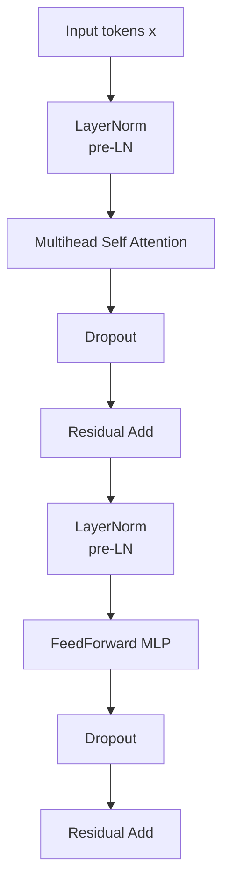

# Transformer-A-Minimal-Interpretable-Implementation
A ground-up PyTorch implementation focusing on attention mechanics, masking, and normalization design choices.

## Project Motivation
Most Transformer tutorials rely heavily on high-level PyTorch modules, which obscures critical design details such as attention masking, normalization placement, and tensor reshaping across heads.
This project aims to rebuild a minimal Transformer from scratch to deeply understand its internal mechanics and trade-offs, while keeping the implementation readable and debuggable.

## Architecture Overview

## Key Design Decisions & Trade-offs
### 3.1 Manual Attention Masking
Instead of relying on PyTorch’s built-in causal attention, I explicitly construct attention masks and apply -inf before softmax.
### 3.2 Custom LayerNorm vs nn.LayerNorm
I implemented a custom LayerNorm to verify normalization behavior, then replaced it with nn.LayerNorm for efficiency. Both implementations were kept to compare correctness and performance.
### 3.3 Multi-Head Attention Reshaping
The model explicitly reshapes the embedding dimension d_model into (num_heads, head_dim) to ensure independent attention subspaces. This helped clarify why individual heads have reduced representational capacity but gain diversity through parallel attention.

## Results & Observations
